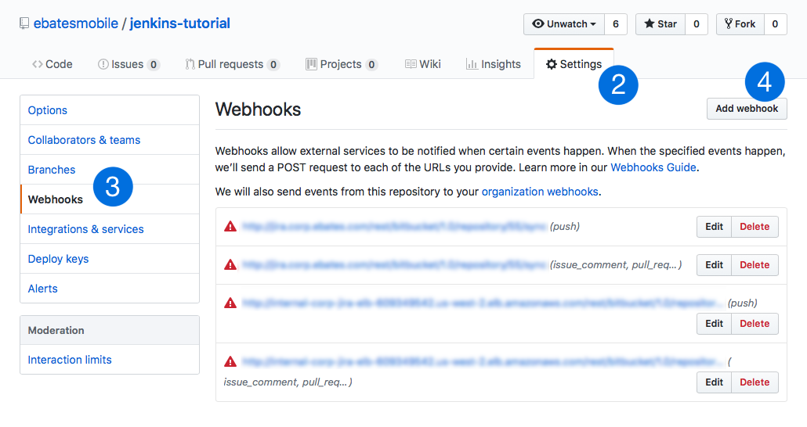
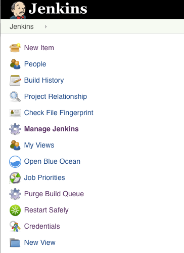

# Jenkins Pipeline setup for iOS 📱

Here at Ebates for iOS continuous integration and deployment, we are using Jenkins which has been working quite well! In this guide, we will be going over the following:

1. Setting up GitHub and Jenkins webhooks
2. Creating new items(formerly known as jobs) on Jenkins
3. Creating declarative pipeline script, a.k.a Jenkinsfile

### Environment

- Jenkins 2.89.3
- Xcode 10.0

### 1. Setting up GitHub for Jenkins webhooks

Your Jenkins server and GitHub will need to be able to communicate to each other in order for a pull request to trigger a build. To do that, let's go to GitHub first to set that up.

1. Go to your repository at github.com
2. Choose `Settings` (If you don't see this option, your admin needs to provide access)
3. Choose `Webhooks` from the left pane
4. Click on `Add webhook` button



5. Add your Jenkins server address with `github-webhook` path. e.g. `http://example.com/github-webhook`
6. Choose `Let me select individual events.` and check `Pushes` and `Pull requests`

Now let's configure Jenkins' webhook.



1. Go to the Jenkins top page and click on `Manage Jenkins` > `Configure System` > `GitHub`
2. `API URL` should be `https://api.github.com`
3. Choose correct credentials. To add new one, go to `Jenkins` > `Credentials` > `System` > `Global Credentials` > `Add Credentials`.
4. Check `Manage hooks`
5. Click on `Advanced`
6. Check `Specify another hook URL for GitHub configuration` and enter the address you entered above. e.g. `http://example.com/github-webhook`

More info on webhook: https://support.cloudbees.com/hc/en-us/articles/224543927-GitHub-webhook-configuration

### 2. Creating new Item on Jenkins

1. Go to your Jenkins server and click on `New Item`
2. Give it a name and choose `Multibranch Pipeline`
3. Under `Branch Sources` type in the repository owner username in `Owner` field. Then, you'll be able to select your repository in `Repository` dropdown menu
4. In `Behaviors` section, delete everything else and only have `Discover pull requests from origin`. This section can be customized to your needs
5. In `Build Configuration` section by default, the pipeline script name is specified as `Jenkinsfile`
6. Use this sample script for the `Jenkinsfile`
```groovy
pipeline {
    agent any
      stages {
          stage('Setup') {
              steps {
                echo "Hello world!👋"
              }
          }
      }
}
```
7. Create a new pull request with this script and your Jenkins machine should detect it and start running the script


### 3. Creating declarative pipeline script: The Jenkinsfile

Pipeline scripts are responsible for defining what your Jenkins item will do for each build. For this guide, we will:

- Clone the repository
- Build an iOS project
- Run unit test
- Notify build status by email

```groovy
pipeline {
    agent any

    stages {
        stage('Build and Test My App') {
            steps {
                script {
                  sh "xcodebuild -workspace MyApp.xcworkspace \
                    -scheme MyApp \
                    -destination 'platform=iOS Simulator,name=iPhone X,OS=12.0' \
                    clean test"
                }
            }
        }
    }
    post {
        success {
            script {
                emailext (subject: "✅ Success",
                   body: "Build URL: ${BUILD_URL}",
                   to: "your@email.com")
            }
        }
        failure {
            script {
                emailext (subject: "🚫 Fail",
                   body: "Build URL: ${BUILD_URL}",
                   to: "your@email.com")  
            }
        }
    }
}
```

That should cover the basics for setting up the iOS continuous integration using Jenkins! 🎉

This tutorial just covers the basics, you can integration with services like Slack for messaging.

If you have more than one pipeline and want to re-use some methods from common methods, you can follow this documentation: https://jenkins.io/doc/book/pipeline/shared-libraries/

Good luck!
